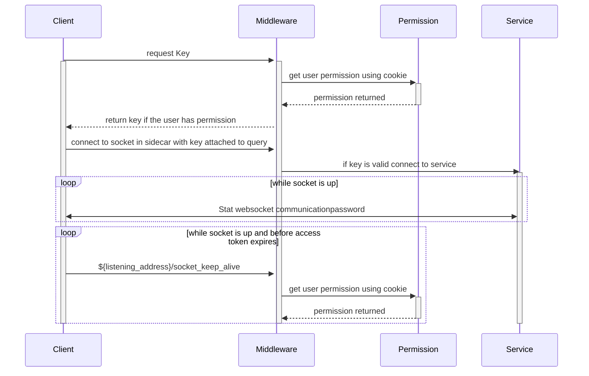
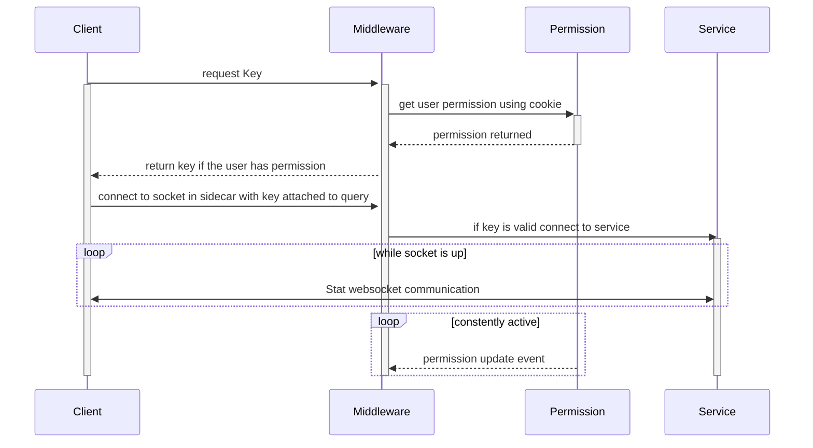

# Permission Middleware Sidecar Architecture and Config
This middleware Service sits between the world and the service it protects—attaching the user's permission as URL parameters.

## Requirements

1. This package uses JWT Registered Claims and requires them to be defined to operate.

   - iss (issuer): Issuer of the JWT
   - sub (subject): Subject of the JWT (the user)
   - aud (audience): Recipient for which the JWT is intended
   - exp (expiration time): Time after which the JWT expires
   - nbf (not before time): Time before which the JWT must not be accepted for processing
   - iat (issued at the time): The time at which the JWT was issued; can be used to determine the age of the JWT
   - jti (JWT ID): Unique identifier; can be used to prevent the JWT from being replayed (allows a token to be used only once)

   The following is an example of jwtPayload

   ```json
   {
     "iss": "example.com",
     "sub": "123e4567-e89b-12d3-a456-426614174000",
     "aud": "example.com",
     "exp": 1728399617,
     "nbf": 1728399517,
     "iat": 1728399517,
     "jti": "123e4567-e89b-12d3-a456-426614174001"
   }
   ```

2. This Project will need an endpoint that will accept the get request and return a JSON list of permissions using the jwt token. the URL for the endpoint will be set as `permission_url`.

## Config

The following is an example of the config

In the following example, the `permissions_url` will return a list containing `nasdaq` and `cta`. hence an endpoint that will return.

```json
["nasdaq", "cta"]
```

The Middleware will then forward requests to `ws://localhost:8080` with the permissions in params like the following `ws://localhost:8080?permissions=nasdaq,cta`

```yaml
socket_encryption_key: "SOME_KEY_USED_FOR_GENERATING_KEYS"permission_url: http://permission_url.com/get_permissionslistening_address: localhost:80sidecar_url: localhost:8080jwt_cookie_name: _act
```

## WebSocket Support

if you are trying to add this middleware in front of a web socket then you are in lock. WebSocket support does work but with a few extra steps.

1. you will need to call `http://${listening_address}/get_websocket_key` this will return a key.
2. once you have a key you can then use the `ws://${listening_address}/${path}?websocket_key=${websocket_key}`to hand over the key to the socket.
3. you will then need to periodically  call `http://${listening_address}/socket_keep_alive`to update your access token on the socket.

the reason why this is complicated is because WebSocket connections don't have access to cookies. since they are not HTTP. this is why you have to periodically call `http://${listening_address}/socket_keep_alive` to keep the session alive and update it with the new access token. if you don't do this all Socket assigned to you will drop. `http://${listening_address}/get_websocket_key` will always return the same key. since it relies on the JWT `sub` as the unique ID. `http://${listening_address}/socket_keep_alive` is smart and knows all WebSocket assigned to you and will simply extend the life of all sockets that are connected.




# Option 2

Allowing the permissions endpoint to update the gateway on users 





# Permission Service Endpoints

1. `http://${permission_uril}/get_permission` this endpoint is a `Get` request with the JWT token attached and will return a list of permission the user has
    * optional url param `filter` may be added with comma separated list of permissions that you care about so that not all the permissions are returned.
    * optional url param `subscribe` may be added to subscribe to future requests
2. `http://${permission_uril}/permission_user_unsubscribe` this endpoint is a `Get` request with the JWT token attached and will unsubscribe from any permission changes
3. `http://${permission_uril}/set_permission_update_hook` this is a `Get` request
    * required url param `hook` must be added with a endpoint to call a user permission changes.