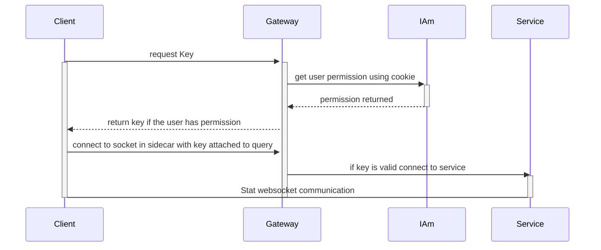

# Permission Gateway Sidecar Architecture and Config

## Config

the following is an example of the config that may be used for a service

in the following example the gateway will check for for the `nasdaq` and `cta` permission and will allow the user to make requests

the gateway will then forward requests to `ws://localhost:8080` with the permissions in params like the following `ws://localhost:8080?permissions=nasdaq,cta`

permissions is an 2d array. where the outer demenstion is or'd and the inner is and'ed.

For example the following says that the user must have `nasdaq` and `cta`

```yaml
- - effect: Allow
    action: read
    resource: nasdaq
  - effect: Allow
    action: read
    resource: cta
```

Where the following says the user must have `nasdaq` or `cta`

```yaml
- - effect: Allow
    action: read
    resource: nasdaq
- - effect: Allow
    action: read
    resource: cta
```

The following example will give the permission

- `nasdaq` if the user has `resource nasdaq` or `resource cta`
- `cta` if the user has `resource cta` and `resource #`

```yaml
encryption_key: "SOME_KEY_USED_FOR_GENERATING_KEYS"
iam_url: http://iamAddress.com
listening_address: localhost:80
redirect_address: localhost:8080
permissions:
  nasdaq:
    - - effect: Allow
        action: read
        resource: nasdaq
    - - effect: Allow
        action: read
        resource: cta
  cta:
    - - effect: Allow
        action: read
        resource: cta
      - effect: Allow
        action: "#"
        resource: "#"
```

## Architecture diagram


